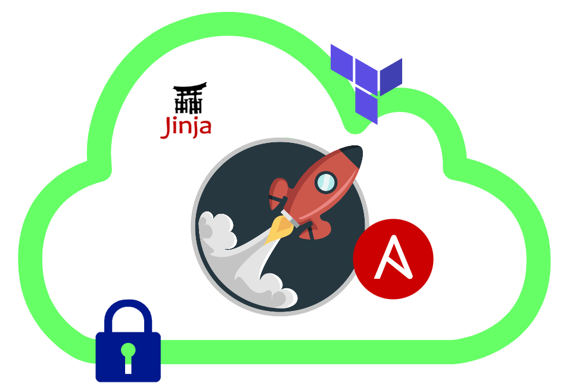
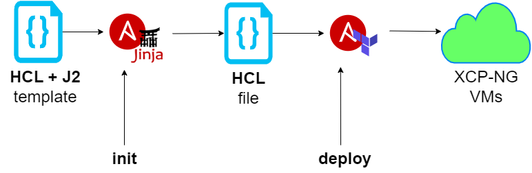

# terraform-ansible-xcp: IaC for XCP-NG
This Ansible playbook allows you to initialize and then deploy an entire infrastructure through the aid of Terraform, on a XCP-NG environment.

Terraform + Ansible

These ansible playbooks and roles are designed for demonstration purposes only. Do not use in your production environments without proper testing first.

## Abstract

The Infrastructure as Code had considerable growth in the cloud lately.
Using the Ansible flexibility and the Terraform power allows users to abstract both the creation and the provisioning of the entire infrastructure, describing the whole process in a single file, easy to read and to maintain on the long run.

